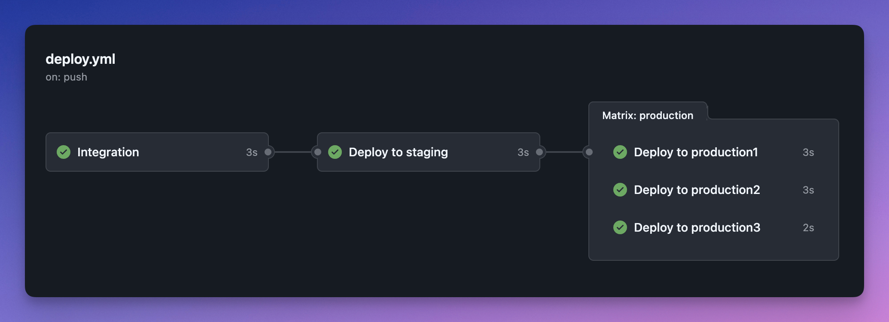

# Pipeline Examples

A set of GitHub Actions workflows to test and demonstrate different kinds of deployment pipeline.

Right now there's just one example, but I might add a few more over time as I explore.

## Deployments with approvals

This example demonstrates a deployment pipeline with three "steps":

1. Integration - build and test
2. Staging - deploy to a staging environment
3. Production - deploy to multiple production environments, with required approvals

The staging and production jobs are associated with [deployment environments](https://docs.github.com/en/actions/concepts/workflows-and-actions/deployment-environments). These environments are created using Pulumi, to allow for flexibility and consistency in the exact set of environments that are deployed to.

The list of production environments is stored in a GitHub repository variable, which is used by the workflow to create a matrix of deployment jobs to deploy to each production environment in parallel.

Each production environment is protected by a [custom deployment protection rule](https://docs.github.com/en/actions/how-tos/deploy/configure-and-manage-deployments/create-custom-protection-rules). Deployment to these environments cannot proceed until approval is received from a GitHub App.

In this example, approval happens immediately, assuming the app is running.

### Files

- [.github/workflows/deploy.yml](.github/workflows/deploy.yml) - the main workflow
- [approver.py](approver.py) - a Modal app to handle approvals
- [pulumi/](pulumi/) - a Pulumi project to manage GitHub environments

